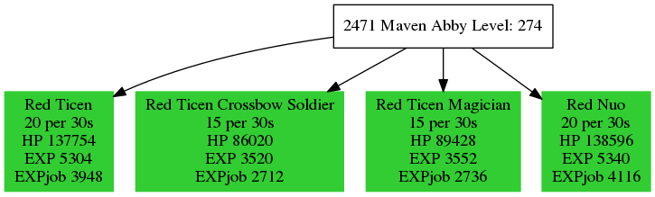

# 0w0
## What can it do?

These scripts can help you find proper farming field.

Monster info will be highlighted in green if it has more than 3,000 base exp.

You can change the thereshold in gmi2dot.sh ( currently line 16th )

Input: 

```bash

./getMapInfo.sh 2471 |./gmi2dot.sh |dot -Tpng -o "2471.png"

```

Then the script will fetch data from tosbase and produce a picture like below.

Output:



Okay... but what is 2471?

The number is the last part of an url from a map description of tosbase.

For example 2471 is:

[http://www.tosbase.com/game/world-map/2471](http://www.tosbase.com/game/world-map/2471)

## Requirement:

- **curl**
	for fetching data
- **sed**
	for data processing
- **grep**
	for data processing
- **dot**
	for making charts
- **bash**
	for scripting
- **image magick**
	for `display`

Note that sed is supposed to be a "gsed". So if you are using BSD based platform you might encounter problems running these scripts.

## usage:

```bash

./getMapInfo.sh |./gmi2dot.sh |dot -Tpng | display -

```

batch


```bash

curl -sv "http://www.tosbase.com/database/maps/?name=&order=Level&type=Field&page=5" |&grep -o "game/world-map/[0-9]*/" |sed 's/[^0-9]//g'|xargs -n1 -P0 ./getMapInfo.sh 

```

lots of picture

```bash

$ cat ./a.sh

#!/bin/bash

./getMapInfo.sh $1 |./gmi2dot.sh |dot -Tpng -o "out/$1.png"
$ curl -sv "http://www.tosbase.com/database/maps/?name=&order=Level&type=Field&page=4" |&grep -o "game/world-map/[0-9]*/" |sed 's/[^0-9]//g'|xargs -n1 -P0 "./a.sh"

```

